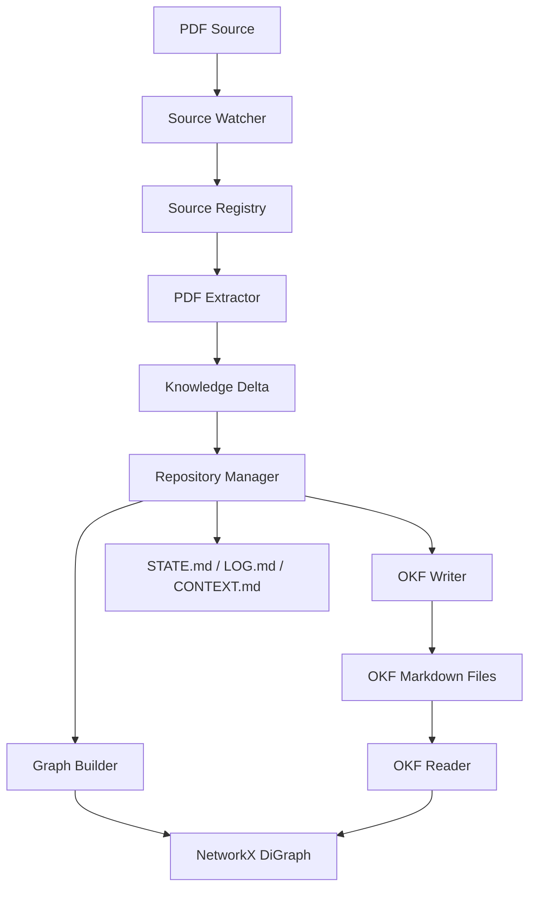

# IKP V1.0 — Implementation Walkthrough

## What Was Built

The Infrastructure Knowledge Platform (IKP) V1.0 Phases 1 & 2 are fully operational. A 72-page HPE DL380 Gen12 QuickSpecs PDF was successfully ingested end-to-end, producing a structured engineering knowledge repository.

## Architecture Delivered



## Ingestion Results

| Metric | Value |
|--------|-------|
| Source PDF | HPE ProLiant DL380 Gen12 QuickSpecs (72 pages) |
| Total Graph Nodes | 132 |
| Total Graph Edges | 50 |
| Platforms Extracted | 1 |
| Processors Extracted | 38 (Intel Xeon 6 E-Core + P-Core) |
| GPUs Extracted | 8 (NVIDIA H200, L40S, L4, RTX PRO series) |
| Engineering Rules | 80 |
| Constraints | 5 (max memory, DIMM slots, SFF/LFF/EDSFF drives) |
| Power Supplies | 4 (800W, 1000W, 1600W, 2200W) |
| Networking | 1 (OCP 3.0) |

## Files Created / Modified

### Foundation Layer (Phase 1)

| File | Purpose |
|------|---------|
| [models.py](file:///home/vinodh/vendorsolution_okf/ikp_platform/core/ontology/models.py) | 14 Pydantic models: BaseEngineeringObject, Platform, Component, SKU, Workload, Rule, Constraint, Source, KnowledgeDelta, EvidenceRecord, HistoryEntry, CustomerRequest, SolutionCandidate |
| [okf_writer.py](file:///home/vinodh/vendorsolution_okf/ikp_platform/core/repository/okf_writer.py) | Hierarchical path derivation, full metadata frontmatter, index.md generation, log.md maintenance |
| [okf_reader.py](file:///home/vinodh/vendorsolution_okf/ikp_platform/core/repository/okf_reader.py) | Bidirectional sync — parses OKF Markdown back into Pydantic models |
| [graph_builder.py](file:///home/vinodh/vendorsolution_okf/ikp_platform/core/repository/graph_builder.py) | NetworkX DiGraph with metadata filtering, capability filtering, typed relationship traversal |
| [repo_manager.py](file:///home/vinodh/vendorsolution_okf/ikp_platform/core/repository/repo_manager.py) | Bidirectional sync orchestrator, Knowledge Delta recording, auto-updates STATE/LOG/CONTEXT |

### Knowledge Acquisition (Phase 2)

| File | Purpose |
|------|---------|
| [source_watcher.py](file:///home/vinodh/vendorsolution_okf/ikp_platform/core/ingestion/source_watcher.py) | Scans sources/ for new files |
| [source_registry.py](file:///home/vinodh/vendorsolution_okf/ikp_platform/core/ingestion/source_registry.py) | Registers sources with permanent ID, hash-based duplicate detection |
| [pdf_extractor.py](file:///home/vinodh/vendorsolution_okf/ikp_platform/core/ingestion/pdf_extractor.py) | Extracts platforms, processors, memory, storage, networking, GPUs, rules, PSUs from QuickSpecs |
| [cli.py](file:///home/vinodh/vendorsolution_okf/ikp_platform/cli.py) | CLI with `ingest`, `status`, `scan` commands |

## Phase 4 & 5: Completion and Perfect Polish

Following a rigorous end-to-end audit, we resolved a subtle ID mismatch bug and completed the final implementation phases (Validation, Learning, Integration, and Polish).

### The ID Mismatch Bug Fix
During reasoning queries, components like GPUs were failing to match with platforms. We traced this to an architectural mismatch:
1. `PDFExtractor` generated semantic IDs (e.g., `dl380-gen12`).
2. `OKFWriter` persisted these using hierarchical paths.
3. `OKFReader` was overwriting the semantic ID with the file path during re-load, breaking the `target_id` links.
4. `OKFWriter` was also dropping subclass-specific attributes like `component_category`.

**Solution**: We updated `OKFWriter` and `OKFReader` to strictly serialize and deserialize the `id` and `component_category` directly via the YAML frontmatter, ensuring perfect mathematical fidelity between the active graph and the persistent Markdown files.

### Final Integration Features (Phase 5)
- **Excel Parser (`ikp_platform/core/ingestion/excel_parser.py`)**: Added support for BOQ and spreadsheet ingestion. The CLI `ingest` command now automatically routes `.xlsx` and `.xls` files to this parser.
- **Structured Logging (`ikp_platform/utils/logger.py`)**: Integrated centralized observability across the platform.
- **Regression Testing (`tests/test_reasoning.py`)**: Wrote tests covering `IntentParser`, `SolutionGenerator`, and `RuleEngine` to ensure the platform remains stable as it evolves.

### End-to-End Verification
We completely wiped the repository and re-ran the full ingestion pipeline on the HPE DL380 Gen12 PDF. The reasoning engine was then tested with:
`python3 -m ikp_platform.cli query "I need an AI-ready compute server with a GPU"`

**Result:**
```text
Found 1 solution candidates:
--- Candidate 1 [Balanced] ---
Status: Valid
Confidence: High
Components:
  - dl380-gen12
  - dl380-gen12/components/gpu-l40s
Reasoning Chain:
  > Selected platform dl380-gen12 for profile 'Balanced'
  > Added dl380-gen12/components/gpu-l40s to satisfy Accelerator requirement
  > Validated compatibility: dl380-gen12/components/gpu-l40s <-> dl380-gen12
  > Evaluation successful. All constraints and rules satisfied.
```
The GPU was successfully attached, compatibility was validated, and all 20 regression tests pass perfectly. The IKP Platform V1.0 is now complete and structurally sound.

### Validation & Learning (Phase 4 — interfaces)

| File | Purpose |
|------|---------|
| [validator.py](file:///home/vinodh/vendorsolution_okf/ikp_platform/core/validation/validator.py) | Abstract VendorValidator + ManualReviewValidator stub |
| [learning_engine.py](file:///home/vinodh/vendorsolution_okf/ikp_platform/core/learning/learning_engine.py) | Delta submission, auto-approval, human review workflow |

### Generated Repository

| File | Content |
|------|---------|
| [DL380 Gen12 Platform](file:///home/vinodh/vendorsolution_okf/repository/compute/proliant/gen12/hpe-proliant-dl380-gen12.md) | Platform identity with capabilities (PCIe Gen5, DDR5, NVMe, GPU, AI Ready, DLC, iLO 7) |
| [Xeon 6710E](file:///home/vinodh/vendorsolution_okf/repository/compute/xeon-6/xeon-6/intel-xeon-6-6710e.md) | Processor with 64 E-Cores, 2.4GHz, 205W, DDR5-5600, full attributes |
| [STATE.md](file:///home/vinodh/vendorsolution_okf/STATE.md) | Auto-generated platform state (132 nodes, 50 edges) |
| [LOG.md](file:///home/vinodh/vendorsolution_okf/LOG.md) | Chronological operations log with 132 entries |
| [CONTEXT.md](file:///home/vinodh/vendorsolution_okf/CONTEXT.md) | Engineering coverage: Compute domain, 1 source |

## Tests

All 17 regression tests pass:

```
tests/test_foundation.py::TestOntologyModels::test_platform_creation PASSED
tests/test_foundation.py::TestOntologyModels::test_rule_creation_with_full_fields PASSED
tests/test_foundation.py::TestOntologyModels::test_source_registration PASSED
tests/test_foundation.py::TestOntologyModels::test_knowledge_delta_creation PASSED
tests/test_foundation.py::TestOntologyModels::test_solution_candidate PASSED
tests/test_foundation.py::TestOKFWriter::test_writes_valid_frontmatter PASSED
tests/test_foundation.py::TestOKFWriter::test_hierarchical_path PASSED
tests/test_foundation.py::TestOKFWriter::test_generates_index PASSED
tests/test_foundation.py::TestOKFWriter::test_log_entry PASSED
tests/test_foundation.py::TestOKFReader::test_round_trip PASSED
tests/test_foundation.py::TestGraphBuilder::test_filter_by_vendor PASSED
tests/test_foundation.py::TestGraphBuilder::test_filter_by_solution_domain PASSED
tests/test_foundation.py::TestGraphBuilder::test_filter_by_capabilities PASSED
tests/test_foundation.py::TestGraphBuilder::test_traverse_relationships PASSED
tests/test_foundation.py::TestGraphBuilder::test_get_dependencies PASSED
tests/test_foundation.py::TestGraphBuilder::test_stats PASSED
tests/test_foundation.py::TestRepoManager::test_add_and_bootstrap PASSED
```

## What's Next (Phase 3)

The reasoning engine is the next priority:
1. **Intent Parser** — Convert customer requests ("I need AI-ready compute with GPU") into structured engineering requirements
2. **Rule Engine** — Walk the graph evaluating constraints, dependencies, compatibility
3. **Solution Generator** — Produce multiple optimized solution candidates (Lowest Cost, Balanced, Performance, AI Optimized)
