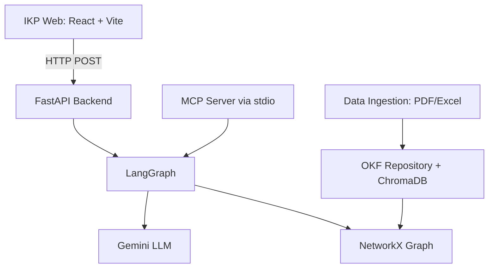

# Intelligent Knowledge Platform (IKP) - Comprehensive KT Guide

Welcome to the `vendorsolution_okf` project! This Knowledge Transfer (KT) document is designed to give Developers, Testers, and Architects a comprehensive, end-to-end understanding of the system. It covers the current architecture, data models, workflows, testing paradigms, scripts, integrations, and architectural gaps discovered via reverse engineering.

---

## 1. Executive Summary
The Intelligent Knowledge Platform (IKP) is a dual-layer system that continuously acquires, reasons over, and validates engineering knowledge for hardware configurations (e.g., servers, networking). Unlike traditional search engines or chatbots, IKP uses an **Engineering Canonical Ontology** and a **Rule Engine** backed by LLMs to parse unstructured vendor documentation (PDFs, Excel) into deterministic, explainable solutions.

---

## 2. System Architecture & Components

### 2.1 Backend (IKP Platform Core)
Located in `ikp_platform/`, built with **Python 3.11** and **FastAPI**.
*   **Data Ingestion (`core/ingestion/`)**: Parses complex vendor data from PDFs (`pdf_extractor.py`) and Excel into canonical Open Knowledge Format (OKF).
*   **Repository (`core/repository/`)**: `GraphBuilder` maintains an in-memory NetworkX directed graph. `OKFWriter/Reader` serialize this graph to Markdown files on disk.
*   **Reasoning (`core/reasoning/`, `core/validation/`)**: 
    *   **IntentParser**: Uses Gemini to translate natural language into structured requirements.
    *   **RuleEngine**: A deterministic engine that enforces strict architectural limits.
*   **Orchestration (`core/workflow/`)**: Uses **LangGraph** to model multi-step reasoning.
*   **Observability**: Uses a `@telemetry_trace` decorator to wrap workflows and API endpoints, capturing duration, payloads, and preventing LLM quota exhaustion.

### 2.2 Frontend (IKP Web)
Located in `ikp_web/`, built with **React**, **Vite**, and **TypeScript**.
*   **Semantic Search (`SemanticSearch.tsx`)**: Queries `/api/search`. Groups results dynamically.
*   **BOQ Validation (`BoqValidation.tsx`)**: Submits raw SKUs to `/api/boq/validate`. Renders per-rule Pass/Fail statuses.

---

## 3. Canonical Data Models (The Ontology)
The single source of truth lies in `ikp_platform/core/ontology/models.py`. Key entities:
*   **BaseEngineeringObject**: The root for all knowledge, requiring an ID, type, and title.
*   **Platform & Component**: Represents deployable infrastructure (e.g., "DL380 Gen11") and its modular parts (CPUs, Drives).
*   **SKU**: Commercially orderable representations of Components. 
*   **Rule & Constraint**: Explicit limits (e.g., CategoryLimit) extracted from vendor docs.

---

## 4. Execution Workflows & Integration Points

### 4.1 BOQ Validation Workflow
1.  **Trigger**: User submits a textual list of SKUs.
2.  **API**: Frontend sends HTTP POST to `/api/boq/validate`.
3.  **Orchestrator**: `build_workflow_graph()` initiates the LangGraph state machine.
4.  **Reasoning**: `RuleEngine.evaluate_solution()` executes a 4-step pipeline: Strict Domain Isolation → Category Limits → Dependencies → Rules.
5.  **Response**: The system returns structured JSON indicating valid/invalid components.

## 5. Method Level Expectations & Flow Clarity

To understand exactly how the system reasons, you must understand the expectations and constraints of the core methods. 

### 5.1 `RuleEngine.evaluate_solution(platform_id, component_ids)`
*   **Location**: `ikp_platform/core/reasoning/rule_engine.py`
*   **Flow**:
    1.  **Strict Domain Isolation**: Checks if components share the same `solution_domain`. Violations trigger immediate hard failures.
    2.  **Category Limit Evaluation**: Sums component quantities (using `inclusive_qty`) and validates them against `CategoryLimit` constraints (e.g., Max Drives = 24).
    3.  **Dependency Checks**: Traverses `Requires` edges in the graph to ensure prerequisites exist.
    4.  **Rule Evaluation**: Uses bidirectional substring matching (as defined in ADR-001) to identify applicable rules, evaluating their severity and logging the evidence trace.
*   **Expectations**: Must return a deterministic `(is_valid, reasoning_chain, errors)` tuple. It does not use the LLM; it is purely deterministic graph traversal.

### 5.2 `GraphBuilder.add_concept(obj)` and `GraphBuilder.get_compatible(node_id)`
*   **Location**: `ikp_platform/core/repository/graph_builder.py`
*   **Flow (`add_concept`)**: Converts Pydantic models (e.g., `Component`, `Rule`) into NetworkX nodes. It ensures critical fields like `applicable_objects` and `description` are correctly mapped to graph attributes (`node_attrs`).
*   **Flow (`get_compatible`)**: Traverses `Compatible With` and `Contains` edges. 
*   **Expectations**: The Graph is the absolute source of truth. It assumes the graph was cleanly rebuilt from Markdown (`OKFReader`) upon startup and holds accurate provenance/evidence metadata.

### 5.3 LangGraph Orchestrator (`build_workflow_graph()`)
*   **Location**: `ikp_platform/core/workflow/graph.py` & `executor.py`
*   **Flow**:
    1.  Starts at `parse_intent` to determine what the user actually wants.
    2.  Transitions to `search_catalog` to fetch actual component IDs from ChromaDB.
    3.  Transitions to `validate_solution` which calls the `RuleEngine`.
    4.  If failures occur, uses conditional edges to loop back or escalate to human review.
*   **Expectations**: Nodes must accept core engines via constructor injection (Dependency Injection) to prevent tight coupling, allowing fully mocked testing without exhausting LLM API limits (ADR-004).

### 5.4 `IntentParser.parse_intent(raw_text)`
*   **Location**: `ikp_platform/core/reasoning/intent_parser.py`
*   **Flow**: Sends the user's raw text to the Gemini LLM with a strictly defined JSON schema.
*   **Expectations**: Must reliably identify the `target_platform` to map queries correctly.

---

## 6. Testing & Quality Assurance

> [!TIP]
> The system utilizes a dual testing approach to isolate UI rendering from backend LLM flakiness.

*   **Backend Pytest (`tests/`)**: Runs via `make test` or `uv run pytest`. Contains heavily mocked E2E tests to prevent LLM Rate Limits (429 errors).
*   **Frontend Playwright (`ikp_web/tests/e2e/`)**: Runs via `npm run test:e2e`. Spins up Chromium workers to validate DOM elements.

### Interactive Browser Test Demonstrations

---

## 6. Peripheral Scripts & CLI Tooling

A reverse engineering of the repository reveals several critical standalone utility scripts that govern operations outside the standard API context.

### 6.1 Debugging Utilities (`scripts/debug/`)
*   `debug_limit_engine.py`: Used by developers to test the `RuleEngine` category limits against mock components without standing up the full API.
*   `debug_concurrency.py`: A stress-testing script to validate thread-safety.
*   `debug_category_limit.py`: Tests boundary conditions for category constraints.
*   `debug_platform_dump.py`: Dumps the in-memory graph to stdout for manual review.

### 6.2 Data Ingestion & Indexing (`ikp_platform/scripts/`)
*   `ingest_catalog.py`: A standalone script to ingest raw vendor catalogs into the internal OKF structure. Bypasses the API.
*   `reindex.py`: A utility to force-rebuild the ChromaDB vector indices from the markdown repository files.

### 6.3 Command-Line Interface (`ikp_platform/cli.py`)
Provides direct CLI commands for CI/CD pipelines or manual operation:
*   `cmd_ingest()`: Ingest a single engineering source file.
*   `cmd_status()`: Boots the `RepoManager` and prints graph object statistics.
*   `cmd_scan()`: Daemonized scanner that watches a directory for new source files to automatically process.
*   `cmd_query()`: Headless natural language querying bypassing the web UI.
*   `cmd_learn()`: Runs the continuous learning loop, processing pending Knowledge Deltas in the `history/` directory.

---

## 7. MCP Integration & Agent Tooling

### 7.1 Model Context Protocol (`mcp_server.py`)
The system explicitly includes an MCP (Model Context Protocol) Server implementation (`ikp_platform/mcp_server.py`).
*   **Transport**: Runs over standard input/output (`stdio_server`), allowing IDEs like Cursor or Claude Desktop to attach directly to it.
*   **Exposed Tools**:
    1.  `query_ikp_solution`: Allows external agents to query the LangGraph orchestrator natively.
    2.  `get_platform_status`: Returns graph metrics to external consumers.

### 7.2 Agent Proxies (`tools/`)
The `tools/` directory contains proxy scripts (`agy`, `pip`, `python`) designed specifically as an OS-agnostic command execution environment. These provide localized sandboxing so autonomous subagents running on the system don't accidentally pollute the host OS.

---

## 8. Build Targets (`Makefile`)

The project utilizes a structured Makefile to standardize execution:
*   `make install`: Synchronizes environments using `uv sync --extra dev`.
*   `make test`: Executes all pytest definitions via `uv run`.
*   `make lint`: Enforces code standards utilizing both `ruff check .` (formatting/linting) and `mypy` (static type checking).
*   `make run`: Starts the FastAPI uvicorn backend.
*   `make ui-install` / `make ui-dev` / `make ui-test`: Wrappers to execute NPM scripts inside the `ikp_web` directory.

---

## 9. Architectural Gaps & Missing Capabilities

By reverse engineering the source code, several explicit gaps and technical debts are evident that a new Architect must account for before pushing this to an enterprise production environment:

> [!WARNING]
> The following infrastructure is missing from the codebase.

1.  **Missing Persistent Graph Database Layer**:
    *   **Evidence**: `okf_reader.py` natively parses Markdown files upon boot to instantiate a `NetworkX` directed graph object (`graph_builder.py`).
    *   **Gap**: While highly auditable, this architecture does not horizontally scale. It requires a dedicated persistent DB (e.g., Neo4j, Amazon Neptune) for distributed query routing.
2.  **Missing Production Observability Sinks**:
    *   **Evidence**: The `ikp_platform/core/observability/__init__.py` `@telemetry_trace` decorator currently only structures local JSON logs.
    *   **Gap**: No OpenTelemetry (OTLP) sink is wired. Without pushing metrics to Datadog, Prometheus, or Grafana, LLM token usage and latency cannot be monitored in real-time.
3.  **Missing Identity, AuthN, & Multitenancy (RBAC)**:
    *   **Evidence**: `api.py` contains fully unauthenticated endpoints (`/search`, `/boq/validate`).
    *   **Gap**: The system lacks OAuth2/OIDC integration. Furthermore, rules and configurations cannot be isolated by tenant or customer (e.g., Customer A sees Customer B's internal engineering guidelines).
4.  **Missing Human-in-the-Loop Feedback Portal**:
    *   **Evidence**: The data models support a `DeltaStatus.NEEDS_REVIEW` phase, and `cli.py` has a `cmd_learn()` loop.
    *   **Gap**: There is no Frontend UI portal (within `ikp_web`) for Senior Engineers to actually click "Approve" or "Reject" on LLM-extracted rules before they are committed.
5.  **Missing Cloud-Native Artifacts**:
    *   **Evidence**: Reliance on `bootstrap.sh` and local `Makefile` commands.
    *   **Gap**: The repository is missing `Dockerfiles` for containerization, Kubernetes `Helm` charts, and automated GitHub Actions / GitLab CI workflows for deployment.

---

## 10. Advanced Orchestration: LLMs, State Management & Continuous Learning

The architecture achieves cognitive autonomy through strict separation of State, Reasoning (LLMs), and Persistence. This design ensures that LLM hallucinations cannot permanently corrupt the canonical repository.

### 10.1 LangGraph State Management (`WorkflowState`)
*   **Orchestration**: Built on LangChain's `StateGraph`, the workflow (`ikp_platform/core/workflow/graph.py`) models a state machine that drives customer intent to a finalized BOM (Bill of Materials).
*   **State Dictionary**: The orchestrator passes a `WorkflowState` dictionary between nodes (`parse_intent` → `select_platform` → `draft_bom` → `validate_bom`).
*   **Cyclic Edges**: Conditional edges like `should_loop_bom()` inspect the state (e.g., `state["is_valid_static"]`). If the `RuleEngine` flags a constraint violation, the graph loops back to `draft_bom` to self-correct.
*   **E2E Decoupling (ADR-004)**: To prevent infinite recursive loops causing Gemini 429 Rate Limits during Pytest runs, node actions receive `IntentParser` and `RuleEngine` via Dependency Injection.

### 10.2 External Tools & Graphify Integration
*   **Graphify Context**: External tools like `graphify` are used by the autonomous subagents (and developers) to generate topological views (`GRAPH_REPORT.md`) of the Python source codebase. This ensures architectural drift is monitored, identifying how `LearningEngine` connects to `RepoManager`, or `PDFExtractor` to `BaseEngineeringObject`.
*   **Seekstone MCP**: Through the Model Context Protocol (`mcp_server.py`), external tools (like Claude Desktop) can invoke `query_ikp_solution` directly, bypassing the UI.

### 10.3 The Continuous Learning Loop (`LearningEngine`)
Governed by Blueprint 02, the platform is designed to learn from failed configurations and new vendor PDFs without requiring manual code changes.
1.  **Delta Generation**: Whenever a new PDF is parsed (`PDFExtractor`) or a failed BOQ is analyzed, a `KnowledgeDelta` is created containing proposed `DeltaChange` operations.
2.  **Learning Queue**: Deltas are submitted to the `LearningEngine`. High-confidence extraction may auto-approve; ambiguous data triggers a `DeltaStatus.NEEDS_REVIEW` state.
3.  **The CLI Loop**: The `cmd_learn()` workflow in `cli.py` routinely processes the `history/` directory. 
4.  **Serialization (`OKFWriter`)**: Once a Delta is validated, `RepoManager` applies the change to the `GraphBuilder`. Crucially, `OKFWriter` immediately serializes the modified objects back into the filesystem as `.md` files in the `repository/` directory. This creates a permanent, git-trackable audit trail of "what the system learned and when it learned it."

---

## 11. Project Workspace & Directory Drill-Down

To ensure coding clarity, here is the exact mapping of where everything lives inside the `vendorsolution_okf/` project workspace. This acts as your navigational compass for contributing.

### `ikp_platform/` (The Brain)
The entire Backend intelligence layer.
*   **`api.py`**: The FastAPI entry point. Defines `/search` and `/boq/validate` HTTP routes.
*   **`cli.py`**: Command-line interface definitions (`cmd_ingest`, `cmd_query`).
*   **`mcp_server.py`**: The Stdio Model Context Protocol integration.
*   **`core/ontology/models.py`**: **CRITICAL FILE.** Defines the canonical data models (`BaseEngineeringObject`, `Component`, `Rule`). Every piece of data in the system adheres to these Pydantic schemas.
*   **`core/workflow/`**: Contains the LangGraph orchestration.
    *   `graph.py`: Wires the conditional edges and nodes.
    *   `nodes.py`: The concrete actions executed during a state transition.
*   **`core/reasoning/`**: The intelligence engines.
    *   `rule_engine.py`: Deterministically traverses the graph to enforce constraints.
    *   `intent_parser.py`: Wraps the Gemini LLM to parse raw text into structured intents.
*   **`core/repository/`**: The persistent storage layer.
    *   `graph_builder.py`: In-memory NetworkX directed graph logic.
    *   `okf_writer.py` / `okf_reader.py`: Serializes and deserializes the graph to Markdown files.
*   **`core/observability/__init__.py`**: Contains the `@telemetry_trace` decorator wrapping all major executions.

### `ikp_web/` (The Face)
The React + Vite frontend application.
*   **`src/App.tsx`**: The main router, managing the tabs (Dashboard, BOQ, Semantic Search, Knowledge Transfer).
*   **`src/components/BoqValidation.tsx`**: Renders the Pass/Fail rules for Bill of Quantities queries.
*   **`src/components/SemanticSearch.tsx`**: Performs dynamic vector searches against ChromaDB.
*   **`public/KT_WALKTHROUGH.md`**: Where this exact Knowledge Transfer document is stored and version-controlled.

### `repository/` & `history/` (The Memory)
*   **`repository/`**: Contains raw `.md` files. This is the canonical source of truth for the system. `OKFWriter` writes here, `OKFReader` reads from here.
*   **`history/`**: Stores pending `KnowledgeDeltas` waiting to be ingested by the `LearningEngine`.

### `scripts/` & `tools/` (The Utilities)
*   **`scripts/debug/`**: Isolated testing scripts to validate rules (`debug_limit_engine.py`) without running FastAPI.
*   **`tools/`**: OS-agnostic command proxies (`agy`, `pip`, `python`) used to sandbox autonomous agents when they interact with the workspace.

### Core Configuration Files
*   **`Makefile`**: Centralizes build targets (`make run`, `make test`, `make lint`, `make ui-dev`).
*   **`pyproject.toml`** / `uv.lock`: Python dependencies managed via `uv`.
*   **`ikp_web/package.json`**: NPM dependencies for the frontend.
*   **`IKP/standards/`**: The Markdown architectural blueprints (like ADR-004) dictating how this platform evolves.
