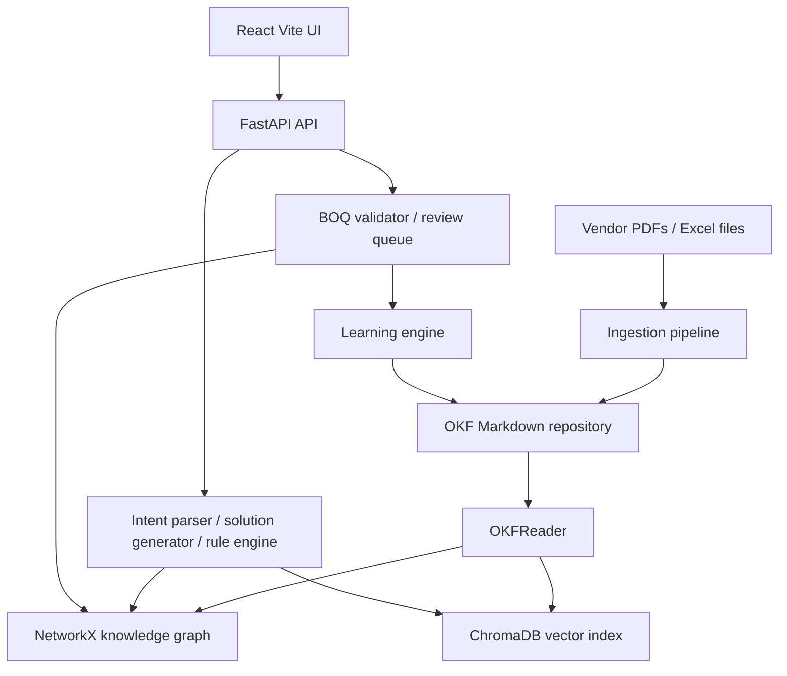

# Intelligent Knowledge Platform KT Guide

Last reviewed: 2026-07-19

This guide explains `vendorsolution_okf` from first principles. It is written for a new developer, tester, architect, or AI agent who needs to understand what the project does before changing it.

## 1. Mental Model

IKP turns vendor engineering documents into a structured knowledge system for hardware solution design.

The system has three layers:

- Canonical knowledge: OKF Markdown files under `repository/`.
- Reasoning engines: Python code that reads the graph, validates rules, and proposes solutions.
- User/API surfaces: FastAPI, React/Vite UI, CLI, and optional MCP.

The important distinction:

- Knowledge Graph means static facts: platforms, components, SKUs, rules, limits, compatibility, evidence.
- LangGraph means workflow process: parse a customer request, choose a platform, draft a BOM, validate it, rank it, or stop for human review.

## 2. Current Architecture



## 3. Quick Start

Install dependencies:

```bash
uv sync --extra dev
npm install --prefix ikp_web
```

Seed the generated OKF repository on a fresh clone:

```bash
./scripts/bootstrap.sh
```

Run the backend and frontend:

```bash
./scripts/start_api.sh
./scripts/start_ui.sh
```

Defaults:

- API: `http://127.0.0.1:8000/api`
- UI: `http://127.0.0.1:5173`

Custom ports:

```bash
./scripts/start_api.sh 8001
./scripts/start_ui.sh 5174 8001
```

The scripts normalize accidental leading-`1` ports. If an agent passes `15173`, the UI runs on `5173`; if it passes `18000`, the API runs on `8000`.

## 4. Key Folders

| Path | Purpose |
|---|---|
| `ikp_platform/api.py` | FastAPI app and HTTP endpoint contracts |
| `ikp_platform/cli.py` | CLI commands for ingest, query, scan, and learn workflows |
| `ikp_platform/mcp_server.py` | Optional MCP server entry point |
| `ikp_platform/core/ontology/models.py` | Canonical Pydantic models |
| `ikp_platform/core/ingestion/` | PDF, Excel, source registry, and parser code |
| `ikp_platform/core/repository/` | OKF reader/writer, graph builder, vector store, MCP client |
| `ikp_platform/core/reasoning/` | Intent parsing, LLM client, solution generation, rule engine |
| `ikp_platform/core/validation/` | BOQ validator and manual review validator |
| `ikp_platform/core/workflow/` | LangGraph state, nodes, executor, and graph wiring |
| `ikp_platform/core/learning/` | Knowledge delta application loop |
| `ikp_web/src/` | React UI |
| `scripts/` | Bootstrap and start helpers |
| `tests/` | Backend tests |
| `IKP/standards/` | Architecture standards and current implementation truth |
| `IKP/references/` | External OKF format reference |

Generated or local-runtime paths:

| Path | Purpose |
|---|---|
| `repository/` | Generated OKF Markdown knowledge repository |
| `repository/manifest.json` | Source registry manifest |
| `needs_review/` | Extraction fallback files for human review |
| `history/` | Knowledge delta history |
| `api_server.log`, `ui_server.log` | Local server logs from start scripts |
| `.api_pid`, `.ui_pid` | Local process IDs from start scripts |

## 5. Ontology Basics

The ontology is defined in `ikp_platform/core/ontology/models.py`.

Important object types:

- `Platform`: a hardware platform such as a server family.
- `Component`: an engineering item that can be part of a solution.
- `SKU`: a commercial/orderable part number.
- `Rule`: a compatibility, requirement, warning, or exclusion.
- `CategoryLimit`: count or capacity limits for a component category.
- `Source`: a vendor document or structured file used as evidence.
- `KnowledgeDelta`: a proposed change to the knowledge repository.

Important relationships:

- `Contains`: platform or category contains an object.
- `Compatible With`: object can be used with another object.
- `Requires`: selecting one object requires another.
- `Incompatible With`: objects must not be selected together.
- `Has SKU`: component maps to a commercial SKU.
- `Supports`: platform/component supports a workload or capability.

## 6. Data Lifecycle

1. A source file is registered by `SourceRegistry`.
2. The file hash is stored so duplicate sources can be detected.
3. PDF or Excel extraction creates ontology objects and deltas.
4. `OKFWriter` writes canonical Markdown into `repository/`.
5. API startup uses `RepoManager.bootstrap()` to load Markdown through `OKFReader`.
6. `GraphBuilder` builds an in-memory NetworkX graph.
7. `VectorStore` indexes selected objects in ChromaDB when embeddings are available.
8. Reasoning and validation use the graph and vector index.
9. Validated learning changes are written back to OKF.

## 7. Main User Flows

### Dashboard

The UI calls `/api/status` to show whether the repository is seeded and to summarize platforms, SKUs, categories, and rules.

### Semantic Search

The UI calls `/api/search`. The backend embeds the query through Gemini, searches ChromaDB, then enriches result IDs with graph metadata.

If `GEMINI_API_KEY` is missing, embedding calls degrade and search may return empty results.

### Solution Synthesis

The UI calls `/api/query`. The backend parses the request, generates candidate solutions from graph/vector data, and returns ranked candidates.

LLM-assisted parsing and component selection use Gemini. Fallback behavior exists, but quality is lower without the key.

### BOQ Validation

The UI calls `/api/boq/validate` with SKUs/components, optional `platform_id`, workloads, and number of alternatives.

The backend:

1. Fuzzy matches input SKUs.
2. Records useful typo corrections as learning deltas.
3. Infers platform from explicit platform nodes or compatibility links when `platform_id` is missing.
4. Runs `RuleEngine.evaluate_solution()`.
5. Returns fuzzy matches, invalid SKUs, rule evaluations, corrected components, and alternatives.

If multiple platforms are detected, the API asks for an explicit `platform_id`.

### Review Queue

The UI calls `/api/review-queue` to list low/medium/unverified objects. `/api/review-queue/approve` can mark an object high confidence. The broader reject/resume lifecycle is still partial.

## 8. Rule Engine Expectations

`RuleEngine.evaluate_solution(platform_id, component_ids)` is deterministic. It should not call an LLM.

It validates:

- platform/component compatibility
- solution-domain isolation
- category limits
- dependency requirements
- explicit rules and incompatible relationships

The expected return shape is:

```text
(is_valid, reasoning_chain, errors)
```

Use this engine for hard technical validation. Use the LLM only for interpretation, extraction, or candidate generation.

## 9. Workflow Status

LangGraph is implemented in `ikp_platform/core/workflow/`.

Current flow:

1. `parse_intent`
2. `select_platform`
3. `draft_bom`
4. `validate_bom`
5. retry while attempts remain
6. `live_portal_validation` placeholder
7. `update_knowledge_base` placeholder
8. `rank_solutions`
9. terminal human-intervention placeholder when unresolved

Important: live partner portal validation is not active. The placeholder currently returns dynamic validation success without contacting an external vendor system.

## 10. Implemented, Partial, Planned

Implemented:

- OKF repository reader/writer
- source registry manifest
- PDF extraction adapter boundary
- HPE QuickSpecs adapter
- Excel `Components` and `SKUs` parsing
- NetworkX graph build/traversal
- ChromaDB vector store
- Gemini LLM and embedding wrapper
- deterministic rule engine
- BOQ fuzzy matching and platform inference
- FastAPI endpoints
- React/Vite UI tabs
- bounded LangGraph workflow
- backend pytest and Ruff lint workflow

Partial:

- human review lifecycle
- learning delta lifecycle
- broad vendor adapter coverage
- semantic quality without embeddings
- solution cost/ranking realism
- mypy/typecheck cleanup

Planned or placeholder:

- live partner portal integration
- live pricing and availability
- portal parser
- persistent graph database
- production deployment/security/observability work

## 11. Development Rules For Agents

- Read `IKP/standards/11_CURRENT_IMPLEMENTATION_STACK.md` before changing architecture docs.
- Use `./scripts/start_api.sh` and `./scripts/start_ui.sh` for local servers.
- Keep API `8000` and UI `5173` unless a task needs different local ports.
- Use `uv run` for Python commands.
- Use `npm run <script>` inside `ikp_web/` or `npm run <script> --prefix ikp_web`.
- Do not edit generated `repository/` artifacts unless the task is explicitly about generated knowledge output.
- Do not claim partner portal validation, live pricing, or full HITL resume is implemented.
- Keep docs synced when endpoint payloads, port defaults, or workflow edges change.

## 12. Quality Commands

```bash
uv run pytest -q
make lint
npm run build --prefix ikp_web
git diff --check
```

`make typecheck` is intentionally separate because the current codebase still has a mypy backlog.

## 13. Troubleshooting

Repository looks empty:

- Run `./scripts/bootstrap.sh`.
- Check `/api/status` and confirm `repository_seeded` is true.

Search returns no results:

- Confirm `GEMINI_API_KEY` is set.
- Rebuild or reseed the repository if source files changed.

UI cannot reach API:

- Confirm API is on `127.0.0.1:8000`.
- Confirm `VITE_API_BASE_URL` if using custom ports.
- Restart with `./scripts/start_api.sh` and `./scripts/start_ui.sh`.

BOQ validation says multiple platforms:

- Provide `platform_id` explicitly.

Rule behavior is confusing:

- Inspect relationships and rule nodes in `repository/`.
- Check `ikp_platform/core/reasoning/rule_engine.py`.
- Add or update focused tests before changing validation semantics.

## 14. Documentation Map

- Current runtime truth: `IKP/standards/11_CURRENT_IMPLEMENTATION_STACK.md`
- Beginner KT: this file
- Setup: `SETUP.md`
- Toolchain rules: `.agents/rules/toolchain.md`
- Knowledge Graph vs LangGraph boundary: `.agents/rules/langgraph_vs_ontology.md`
- Audit backlog: `IKP/QUALITY_AUDIT_GAPS.md`
- OKF external reference: `IKP/references/OKF_SPECIFICATION.md`
