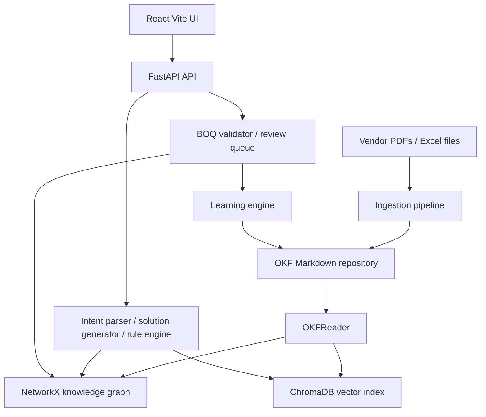
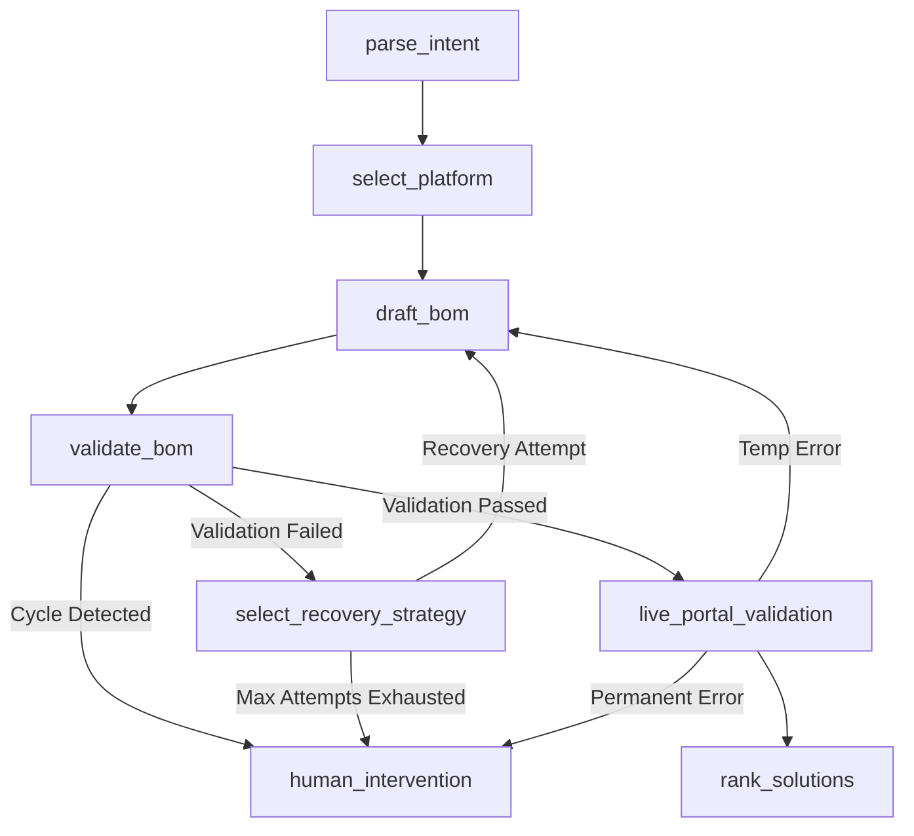

# Intelligent Knowledge Platform KT Guide

Last reviewed: 2026-07-19

This guide explains `vendorsolution_okf` from first principles. It is written for a new developer, tester, architect, or AI agent who needs to understand what the project does before changing it.

## 1. Mental Model

> [!WARNING]
> This platform has no authentication and no rate limiting. It is not currently production-ready and is designed for internal engineering use.

IKP turns vendor engineering documents into a structured knowledge system for hardware solution design.

The system has three layers:

- Canonical knowledge: OKF Markdown files under `repository/`.
- Reasoning engines: Python code that reads the graph, validates rules, and proposes solutions.
- User/API surfaces: FastAPI, React/Vite UI, CLI, and optional MCP.

The important distinction:

- Knowledge Graph means static facts: platforms, components, SKUs, rules, limits, compatibility, evidence.
- LangGraph means workflow process: parse a customer request, choose a platform, draft a BOM, validate it, rank it, or stop for human review.

## 2. Current Architecture



## 3. Quick Start

Install dependencies:

```bash
uv sync --extra dev
npm install --prefix ikp_web
```

Seed the generated OKF repository on a fresh clone:

```bash
./scripts/bootstrap.sh
```

Run the backend and frontend:

```bash
./scripts/start_api.sh
./scripts/start_ui.sh
```

Defaults:

- API: `http://127.0.0.1:8000/api`
- UI: `http://127.0.0.1:5173`

Custom ports:

```bash
./scripts/start_api.sh 8001
./scripts/start_ui.sh 5174 8001
```

The scripts normalize accidental leading-`1` ports. If an agent passes `15173`, the UI runs on `5173`; if it passes `18000`, the API runs on `8000`.

## 4. Key Folders

| Path | Purpose |
|---|---|
| `ikp_platform/api.py` | FastAPI app and HTTP endpoint contracts |
| `ikp_platform/cli.py` | CLI commands for ingest, query, scan, and learn workflows |
| `ikp_platform/mcp_server.py` | Optional MCP server entry point |
| `ikp_platform/core/ontology/models.py` | Canonical Pydantic models |
| `ikp_platform/core/ingestion/` | PDF, Excel, source registry, and parser code |
| `ikp_platform/core/repository/` | OKF reader/writer, graph builder, vector store, MCP client |
| `ikp_platform/core/reasoning/` | Intent parsing, LLM client, solution generation, rule engine |
| `ikp_platform/core/validation/` | BOQ validator and manual review validator |
| `ikp_platform/core/workflow/` | LangGraph state, nodes, executor, and graph wiring |
| `ikp_platform/core/learning/` | Knowledge delta application loop |
| `ikp_platform/scripts/` | Internal Python scripts (`ingest_catalog.py`, `reindex.py`) |
| `ikp_web/src/` | React UI |
| `scripts/` | Top-level bash shell scripts for bootstrap and start helpers |
| `tests/` | Backend tests |
| `IKP/standards/` | Architecture standards and current implementation truth |
| `IKP/references/` | External OKF format reference |

Generated or local-runtime paths:

| Path | Purpose |
|---|---|
| `repository/` | Generated OKF Markdown knowledge repository |
| `repository/manifest.json` | Source registry manifest |
| `needs_review/` | Extraction fallback files for human review |
| `history/` | Knowledge delta history |
| `api_server.log`, `ui_server.log` | Local server logs from start scripts |
| `.api_pid`, `.ui_pid` | Local process IDs from start scripts |

## 5. Ontology Basics

The ontology is defined in `ikp_platform/core/ontology/models.py`.

Important object types:

- `Platform`: a hardware platform such as a server family.
- `Component`: an engineering item that can be part of a solution.
- `SKU`: a commercial/orderable part number.
- `Rule`: a compatibility, requirement, warning, or exclusion.
- `CategoryLimit`: count or capacity limits for a component category.
- `Source`: a vendor document or structured file used as evidence.
- `KnowledgeDelta`: a proposed change to the knowledge repository.

Important relationships:

- `Contains`: platform or category contains an object.
- `Compatible With`: object can be used with another object.
- `Requires`: selecting one object requires another.
- `Incompatible With`: objects must not be selected together.
- `Has SKU`: component maps to a commercial SKU.
- `Supports`: platform/component supports a workload or capability.

## 6. Data Lifecycle & Ingestion

1. **Source Registration & Fingerprinting**: A source file is registered by `SourceRegistry`. A cryptographic SHA-256 hash (`hashlib.sha256`) is computed on the file contents. This fingerprint ensures that duplicate sources are rejected, saving redundant processing. Separately, a background `source_watcher.py` daemon independently tracks file hashes to monitor changes in the `sources/` tree.
2. **Parsing & Extraction boundaries**: 
   - PDFs use `BasePDFAdapter` for extraction, with vendor-specific implementations like `HPEQuickSpecsAdapter` extracting hardware topologies, limits, and rules.
   - Excel sheets use `ExcelExtractor` for parsing structured `Components` and `SKUs` tabs.
3. **Semantic Deduplication**: During ingestion, difflib-based semantic matching prevents duplicate `Rule` generation if the node already exists semantically but with slightly different text.
4. **Knowledge Writing**: `OKFWriter` writes canonical Markdown into `repository/`.
5. **Runtime Bootstrapping**: API startup uses `RepoManager.bootstrap()` to load Markdown through `OKFReader`.
6. **Graph & Vectorization**: `GraphBuilder` builds an in-memory NetworkX graph. `VectorStore` indexes selected objects in ChromaDB when embeddings are available.
7. **Execution**: Reasoning and validation workflows query the graph and vector index.
8. **Learning Engine & Knowledge Deltas**: 
   - Any runtime corrections (e.g., SKU typos fixed by fuzzy matching, or portal rejections) are logged as `KnowledgeDelta` objects.
   - The Learning Engine stores these deltas in `history/`. 
   - Validated deltas are merged back into the canonical OKF markdown (updating the "What"), ensuring that static and dynamic learnings actively improve the Knowledge Graph.

## 7. Main User Flows

### Dashboard

The UI calls `/api/status` to show whether the repository is seeded and to summarize platforms, SKUs, categories, and rules.

### Semantic Search

The UI calls `/api/search`. The backend embeds the query through Gemini, searches ChromaDB, then enriches result IDs with graph metadata.

If `GEMINI_API_KEY` is missing, embedding calls degrade and search may return empty results.

### Solution Synthesis

The UI calls `/api/query`. The backend parses the request, generates candidate solutions from graph/vector data, and returns ranked candidates.

LLM-assisted parsing and component selection use Gemini. Fallback behavior exists, but quality is lower without the key.

### BOQ Validation

The UI calls `/api/boq/validate` with SKUs/components, optional `platform_id`, workloads, and number of alternatives.

The backend:

1. Fuzzy matches input SKUs.
2. Records useful typo corrections as learning deltas.
3. Infers platform from explicit platform nodes or compatibility links when `platform_id` is missing.
4. Runs `RuleEngine.evaluate_solution()`.
5. Returns fuzzy matches, invalid SKUs, rule evaluations, corrected components, and alternatives.

If multiple platforms are detected, the API asks for an explicit `platform_id`.

### Review Queue

The UI calls `/api/review-queue` to list low/medium/unverified objects. `/api/review-queue/approve` can mark an object high confidence. 
The broader reject/resume lifecycle is still partial, but the following experimental endpoints exist for it:
- `/api/review-queue/deltas`: List knowledge deltas waiting for review.
- `/api/review-queue/deltas/{id}/approve`: Approve a specific delta.
- `/api/review-queue/deltas/{id}/reject`: Reject a specific delta.

### Other Endpoints
- `/api/validate`: Manual validation endpoint (distinct from `/api/boq/validate`).
- `/api/status/integrations`: Shows availability of external integrations (LLM, vector index, MCP).

## 8. Observability & Telemetry (Langfuse)

To ensure clarity and perfection in telemetry, the platform enforces strict observability across all reasoning and workflow nodes.

- **`@telemetry_trace` Decorator**: Found in `ikp_platform/core/observability/__init__.py`, this wraps critical operations. It automatically logs execution start, success, and error events in structured JSON format.
- **Sanitization**: Sensitive inputs (passwords, tokens) are sanitized. Kwargs and outputs are truncated to prevent log bloat while preserving execution duration and result types.
- **Langfuse Integration**: If `LANGFUSE_PUBLIC_KEY` is configured, `@telemetry_trace` transparently wraps functions with `langfuse.decorators.observe(as_type="generation")`. This provides deep LLM pipeline tracing, visualizing agent reasoning loops, latency, and token usage in the Langfuse dashboard.

## 9. Rule Engine Expectations

`RuleEngine.evaluate_solution(platform_id, component_ids)` is deterministic. It should not call an LLM.

It validates:

- platform/component compatibility
- solution-domain isolation
- category limits
- dependency requirements
- explicit rules and incompatible relationships

The expected return shape is:

```text
(is_valid, reasoning_chain, errors)
```

Use this engine for hard technical validation. Use the LLM only for interpretation, extraction, or candidate generation.

## 10. LangGraph Orchestrator Integration

LangGraph governs the dynamic process flow (the "How") over the static Knowledge Graph (the "What"), implemented in `ikp_platform/core/workflow/`.

### Understanding Retries in IKP
The term "retry" means three completely different things in this codebase. They must not be conflated:
1. **LLM Retry**: HTTP-429 API key rotation for Gemini via `LLMClient` (transient, no business logic).
2. **Attempt Retry**: The business logic draft/validate loop (bounded at 3 max attempts).
3. **Recovery Strategy**: The 4-tier fallback cascade selected dynamically by `select_recovery_strategy` when validation fails.

### The Bounded Draft/Validate Loop

The state machine for generating and validating a BOM is legitimately non-trivial. Below is the orchestration diagram for this loop:



The workflow state machine follows a strict sequence:
1. **`parse_intent`**: LLM interprets the customer request into `CustomerRequirement` Pydantic models.
2. **`select_platform`**: Traverses the Knowledge Graph to select a platform supporting the target workload.
3. **`draft_bom`**: Generates a Bill of Materials candidate.
4. **`validate_bom`**: Deterministically validates the BOM against the graph rules.
5. **Looping**: If validation fails, `attempt_count` increments. The workflow loops between drafting and validating until successful or `max_attempts` (default 3) is reached.

### Live Partner Portal Data Integration
6. **`live_portal_validation` (Integration boundary)**:
   - Evaluates the validated static BOM against dynamic vendor portal data (pricing, stock, availability, or live configurator APIs).
   - If dynamic validation fails (e.g. part out of stock, or configurator rejection), it generates temporary or permanent errors.
   - **Static vs Dynamic Learnings**: Portal rejections are captured. Temporary errors trigger workflow retries; permanent errors create `KnowledgeDelta` objects for the Learning Engine to ingest. 
   - *Note: While the orchestration boundary is fully implemented, actual live HTTP scraping/API calls remain a placeholder.*

7. **`human_intervention`**: If `max_attempts` are exhausted across static or dynamic loops, unresolved cases route to this terminal node instead of looping forever, placing the BOM in a review queue.
8. **`rank_solutions`**: Successfully validated solutions are scored and ranked.

## 11. Implemented, Partial, Planned

Implemented:

- OKF repository reader/writer
- source registry manifest
- PDF extraction adapter boundary
- HPE QuickSpecs adapter
- Excel `Components` and `SKUs` parsing
- NetworkX graph build/traversal
- ChromaDB vector store
- Gemini LLM and embedding wrapper
- deterministic rule engine
- BOQ fuzzy matching and platform inference
- FastAPI endpoints
- React/Vite UI tabs
- bounded LangGraph workflow
- backend pytest and Ruff lint workflow

Partial:

- human review lifecycle
- learning delta lifecycle
- broad vendor adapter coverage
- semantic quality without embeddings
- solution cost/ranking realism
- mypy/typecheck cleanup

Planned or placeholder:

- live partner portal integration
- live pricing and availability
- portal parser
- persistent graph database
- production deployment/security/observability work

## 12. Development Rules For Agents & Humans

> [!TIP]
> **For Humans:** If you have architecture questions, use the `graphify` tool! Run `graphify query "<question>"` to search the knowledge graph in `graphify-out/`. There are also critical operational landmines (e.g. `.gitignore` rules) defined in `.agents/rules/agent-gotchas.md` and `.agents/rules/architecture_state.md`. You should read these agent rules to understand how the system is wired.

- Read `IKP/standards/11_CURRENT_IMPLEMENTATION_STACK.md` before changing architecture docs.
- Use `./scripts/start_api.sh` and `./scripts/start_ui.sh` for local servers.
- Keep API `8000` and UI `5173` unless a task needs different local ports.
- Use `uv run` for Python commands.
- Use `npm run <script>` inside `ikp_web/` or `npm run <script> --prefix ikp_web`.
- Do not edit generated `repository/` artifacts unless the task is explicitly about generated knowledge output.
- Do not claim partner portal validation, live pricing, or full HITL resume is implemented.
- Keep docs synced when endpoint payloads, port defaults, or workflow edges change.

## 13. Quality Commands

```bash
uv run pytest -q
make lint
make typecheck
npm run build --prefix ikp_web
git diff --check
npx playwright test --config=ikp_web/playwright.config.ts  # E2E Tests
locust -f tests/performance/locustfile.py                 # Load Tests
```

`make typecheck` (mypy/pyright checks) are completely clean and strictly enforced.

## 14. Troubleshooting

Repository looks empty:

- Run `./scripts/bootstrap.sh`.
- Check `/api/status` and confirm `repository_seeded` is true.

Search returns no results:

- Confirm `GEMINI_API_KEY` is set.
- Rebuild or reseed the repository if source files changed.

UI cannot reach API:

- Confirm API is on `127.0.0.1:8000`.
- Confirm `VITE_API_BASE_URL` if using custom ports.
- Restart with `./scripts/start_api.sh` and `./scripts/start_ui.sh`.

BOQ validation says multiple platforms:

- Provide `platform_id` explicitly.

Rule behavior is confusing:

- Inspect relationships and rule nodes in `repository/`.
- Check `ikp_platform/core/reasoning/rule_engine.py`.
- Add or update focused tests before changing validation semantics.

## 15. Headless Offline Synthesis & Feedback Loops

The LangGraph orchestration pipeline possesses a crucial headless offline capability where it continuously synthesizes, tests, and repairs Bill of Materials (BOMs) against the OKF static rule engine. This enables universal, vendor-agnostic resolution of missing and invalid components.

### 15.1. Contextual Error Feedback
When `draft_bom` attempts to generate a BOM and the `validate_bom` node flags static discrepancies, the errors are actively pipelined into `CustomerRequest.previous_errors`. The system uses these historical context arrays to loop and adapt.

### 15.2. Smart Component Self-Correction
The `SolutionGenerator` aggressively patches BOM constraints during generation:
- **Negative Scenarios (Invalid SKUs):** If an offline SKU fails validation (e.g. `Invalid SKU: BAD-SKU-999`), the generator parses the error, purges the invalid SKU from the search parameters, and dynamically finds a valid alternative that matches the customer's workloads.
- **Neutral Scenarios (Missing Mandatories):** If the rule engine mandates specific component categories (e.g. `CPU` or `MEMORY` must be present), but the customer omitted them, the generator identifies the `Missing core categories` error. It then autonomously creates `CustomerRequirement` objects for these missing categories and triggers the heuristic fallback to select the most optimal compatible components.

### 15.3. Delta Tracking & Telemetry
In `rank_solutions`, the generator builds a differential profile:
- Analyzes what was explicitly **added**, **removed**, or **updated** against the original BOQ to make the solution valid.
- Profiles the successful iterations into `Lowest Cost`, `Balanced`, and `Performance Optimized` solutions, while keeping detailed telemetry of the corrections made via Langfuse.

## 16. Documentation Map

- Current runtime truth: `IKP/standards/11_CURRENT_IMPLEMENTATION_STACK.md`
- Beginner KT: this file
- Setup: `SETUP.md`
- Toolchain rules: `.agents/rules/toolchain.md`
- Knowledge Graph vs LangGraph boundary: `.agents/rules/langgraph_vs_ontology.md`
- Audit backlog: `IKP/QUALITY_AUDIT_GAPS.md`
- OKF external reference: `IKP/references/OKF_SPECIFICATION.md`


# Architecture and Recovery Workflow Learnings (KT)

> [!NOTE]
> This Knowledge Transfer (KT) document captures the learnings and insights gathered during the hardening, testing, and debugging phases of the Partner Portal Recovery Workflow orchestration using LangGraph.

## 1. Pydantic Model Alignment (The `ValidationFailure` Trap)

During boundary testing, we encountered an infinite loop caused by a seemingly minor field mismatch between how a model was defined and how it was accessed.

### The Issue
- `ValidationFailure` is a Pydantic model defined in `ikp_platform/core/ontology/models.py`.
- It defines the field for the offending component as `object_id`.
- During mocking and testing, we instantiated it with `failed_object_id`. Pydantic, depending on its configuration, silently accepted the extra argument, leaving `object_id` as `None`.
- In `select_recovery_strategy`, we used `failed_obj = failure.get("object_id") if isinstance(...) else getattr(failure, "object_id", None)`.
- Because `object_id` was `None`, the orchestrator skipped all targeted recovery strategies (substitute, drop optional, exclude and regenerate) and returned an empty state update `{}`.

### The Learning
- **Strict Data Contracts**: In a state machine, the orchestrator relies entirely on the exact payload structure to route nodes. Always use strict Pydantic parsing and avoid accessing properties dynamically (`getattr` with `None` defaults) unless the field is genuinely optional in the business logic.
- **Fail Fast**: If a failure is reported but `object_id` is missing when the failure type implies it should be present (e.g., `INCOMPATIBLE`), log a critical warning and route to `human_intervention` rather than silently returning `{}`.
- **Test Alignment**: Test mocks must strictly adhere to the Pydantic models. We should enable `extra = "forbid"` in the Pydantic model configuration (`ConfigDict(extra="forbid")`) to prevent instantiation with non-existent fields.

## 2. LangGraph State Mutability and Retention

We observed behaviors related to how LangGraph persists keys in the `WorkflowState` TypedDict.

### The Issue
- If `select_recovery_strategy` returns `{"needs_regeneration": True}`, this flag persists in the state indefinitely unless a subsequent node explicitly returns `{"needs_regeneration": False}`.
- In our case, `draft_bom` ran but did NOT return `needs_regeneration=False`. Consequently, the state retained `needs_regeneration=True`.
- The router logic (`route_recovery`) checks `state.get("needs_regeneration")`. If it isn't cleared, the router can make incorrect decisions on subsequent loops.

### The Learning
- **Clear Flags After Use**: Nodes that act upon state flags (like `draft_bom` acting upon `needs_regeneration`) **must** clear the flag by returning `{"needs_regeneration": False}` in their payload.
- **Pure Reducers**: When possible, use reducers or specific message structures rather than toggling global boolean flags. If boolean flags are necessary, strictly document which node is responsible for setting and clearing them.

## 3. Oscillation and Cycle Detection

The orchestrator requires robust mechanisms to prevent infinite loops when interacting with external or static rule engines.

### The Solution Implemented
- We implemented a `visited_bom_hashes` list in the state.
- In `validate_bom`, we compute an SHA-256 hash of the `current_bom` sorted list.
- If the hash is already in `visited_bom_hashes` and the validation fails, we set `cycle_detected=True`.
- The `should_loop_bom` router explicitly checks for `cycle_detected` and immediately routes to `human_intervention`.

### The Learning
- **Deterministic State Signatures**: Tracking raw lists of strings is inefficient. Using cryptographic hashes (SHA-256) of the sorted component lists provides a clean, fast, and reliable way to detect identical states.
- **Early Exit**: Do not wait for the `attempt_count` limit if a cycle is detected. Hitting the same state twice means the recovery logic is stuck. Exit to Human-in-the-Loop (HITL) immediately.

## 4. Testing LangGraph Workflows with Mocks

Patching nodes within a compiled LangGraph requires careful attention to method binding and side effects.

### The Issue
- When patching a class method (e.g., `WorkflowNodes.draft_bom`) and replacing its `side_effect` with a lambda, the `self` argument is often omitted by the Mock framework when called dynamically by LangGraph.
- This resulted in `TypeError: <lambda>() missing 1 required positional argument: 'state'`.

### The Learning
- **Use `*args, **kwargs` in Mocks**: When mocking LangGraph nodes, always define the side-effect lambda/function using `*args, **kwargs` and defensively extract the state.
  ```python
  def _mock_draft_fn(*args, **kwargs):
      state = args[0] if args else kwargs.get("state", {})
      return {...}
  ```
- **Patch the Generator, not the Node**: Instead of mocking the entire `draft_bom` node, mock the underlying `SolutionGenerator` or `RuleEngine`. This preserves the node's internal state management (like incrementing `attempt_count` and clearing flags) while controlling the business logic output.

## 5. Ingestion and Data Source Improvements (Self-Evaluation)

Reflecting on the data sources and parsing logic:

1. **Graph Completeness**: The recovery logic heavily relies on `graph.get_related(failed_obj, "Replaces")` and `Compatible With`. If the ingestion pipeline doesn't build these edges accurately from the raw PDFs or BOQs, the recovery engine is paralyzed. Future ingestion work should prioritize extracting bidirectional compatibility and substitute mappings.
2. **Standardized Naming (SKU vs Component Name)**: The rule engine evaluates component names/IDs. If the ingestion pipeline creates nodes with `Part Number` but the LLM drafts a BOM with a colloquial `Name`, they won't match in the graph. Normalization (e.g., forcing all evaluations to use SKU hashes or normalized IDs) is essential.
3. **Optionality Extraction**: The recovery step `Drop optional component` relies on `node.get("attr_is_required", True)`. The ingestion phase must rigorously parse configurations to identify what is truly mandatory versus optional.

## Conclusion
The workflow is now hardened against infinite loops, correctly respects iteration boundaries, and exposes its internal state (`attempt_count`, `cycle_detected`) for robust integration testing. These patterns should serve as the blueprint for extending the IKP platform.
